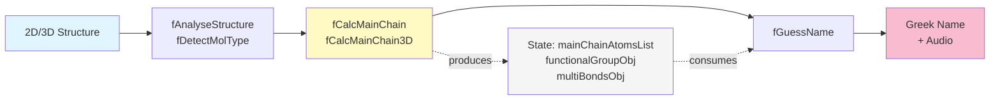
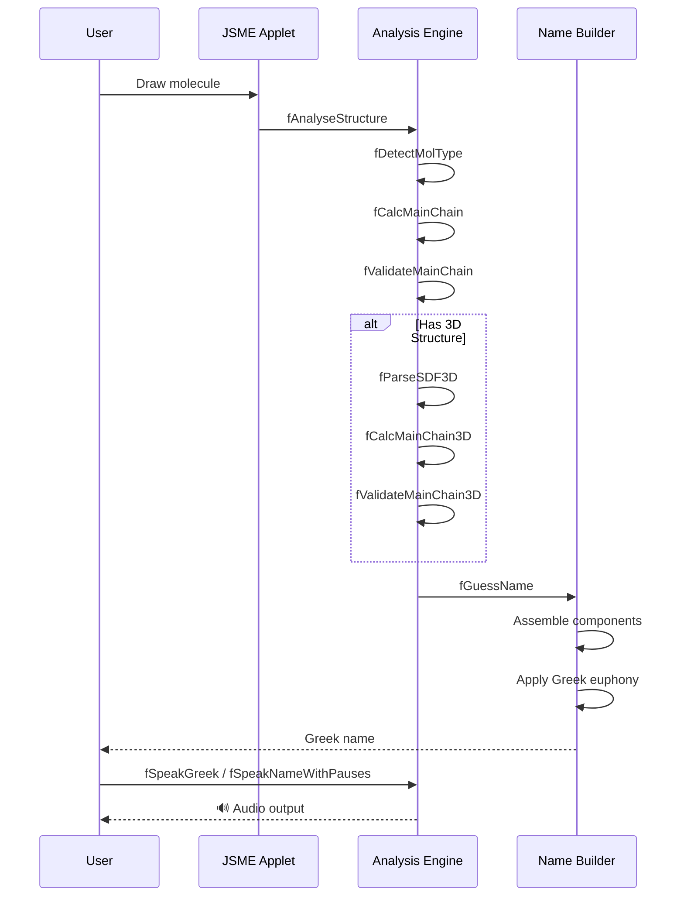

# Mermaid Flowchart: Molecular Nomenclature Analysis Engine

```mermaid
graph TD
    A["🧬 Molecular Nomenclature Analysis Engine<br/>(Pure JavaScript, no DOM/jQuery)"]
    
    A --> B["fInitNamingProps()"]
    B --> B1["• Greek hydrocarbon names<br/>• Functional group suffixes & prefixes<br/>• Multiplicity prefixes"]
    B1 --> C["User Draws Molecule in JSME<br/>(2D Structure)"]
    
    C --> D["fAnalyseStructure()"]
    D --> D1["• Get atoms from JSME applet<br/>• Calculate connectivity & valence<br/>• Calculate C-H count<br/>• Analyze bonds<br/>• Categorize C-C multi-bonds"]
    
    D1 --> E["fDetectMolType()"]
    E --> E1["Identify Functional Groups:<br/>• Hydrocarbon<br/>• Halogens • Alcohols<br/>• Aldehydes • Ketones<br/>• Carboxylic acids<br/>• Cyanides • Amines<br/>• Nitro groups • Ethers"]
    
    E1 --> F["fCalcMainChain()"]
    F --> F1["STEP 1-6: Build C-only graph<br/>Find terminal carbons<br/>DFS enumerate paths<br/>Identify anchor carbons<br/>Pre-compute multi-bonds"]
    
    F1 --> F2["STEP 7: Score All Paths<br/>Priority: length → anchors →<br/>multi-bonds → double bonds"]
    
    F2 --> F3["STEP 8: Orient Path<br/>Rule A: Forced-C1<br/>Rule B: Lowest-locant<br/>Tier 1-3 priority"]
    
    F3 --> F4["STEP 9-10: Convert indices<br/>Validate vs examples"]
    
    F4 --> G["fValidateMainChain()"]
    G --> G1{"Validation Check"}
    G1 -->|Match| G2["✓ No warning"]
    G1 -->|Mismatch| G3["✗ Length/Atom/Direction<br/>Mismatch Warning"]
    
    G2 --> H{3D Structure<br/>Available?}
    G3 --> H
    
    H -->|Yes| H1["fParseSDF3D()"]
    H1 --> H2["fDetectMolType3D()"]
    H2 --> H3["fCalcMainChain3D()"]
    H3 --> H4["fValidateMainChain3D()"]
    H4 --> I
    
    H -->|No| I["fGuessName()"]
    
    I --> I1["Component Assembly<br/>Greek Nomenclature:"]
    I1 --> I2["comp0: Multi-bond locants<br/>comp1: Main chain base<br/>comp2: Unsaturation suffix<br/>comp3: Secondary bond locants<br/>comp4: FG suffix & prefix"]
    
    I2 --> I3["Handle Multiple FGs<br/>Priority: carboxylicAcid ><br/>cyanide > aldehyde > ketone ><br/>alcohol > amine > nitro"]
    
    I3 --> I4["Apply Greek Euphony Rules<br/>consonant+consonant → 'ο'<br/>π/τ+δ → 'α'"]
    
    I4 --> J["currentMolName =<br/>Assembled Greek Name"]
    
    J --> K["Output Options"]
    K --> K1["📊 Display in UI"]
    K --> K2["🔊 fSpeakGreek"]
    K --> K3["🔊 fSpeakNameWithPauses"]
    
    style A fill:#e1f5ff
    style F fill:#fff9c4
    style G fill:#fff9c4
    style I fill:#c8e6c9
    style J fill:#f8bbd0
    style K fill:#ffe0b2
```

## Key Data Flow

## Function Call Sequence

## Export Options

**For PowerPoint/Google Slides:**
1. Copy the Mermaid code
2. Paste into: https://mermaid.live (free online editor)
3. Export as SVG or PNG
4. Insert into your presentation

**For PDF dissertations:**
1. Use mermaid.live → Export as PDF
2. Or convert SVG with Inkscape/online tools

**For markdown documents:**
Just include the code block as-is (GitHub/GitLab will render it automatically)

## Key Data Flow

## Function Call Sequence

## Export Options

**For PowerPoint/Google Slides:**
1. Copy the Mermaid code
2. Paste into: https://mermaid.live (free online editor)
3. Export as SVG or PNG
4. Insert into your presentation

**For PDF dissertations:**
1. Use mermaid.live → Export as PDF
2. Or convert SVG with Inkscape/online tools

**For markdown documents:**
Just include the code block as-is (GitHub/GitLab will render it automatically)
