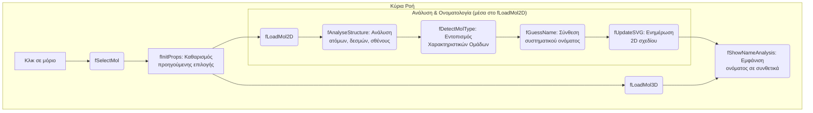

```mermaid
graph TD
    subgraph "Κύρια Ροή"
        A[Κλικ σε μόριο] --> B(fSelectMol);
        B --> C[fInitProps: Καθαρισμός<br>προηγούμενης επιλογής];
        C --> D(fLoadMol2D);
        C --> E(fLoadMol3D);
        
        subgraph "Ανάλυση & Ονοματολογία (μέσα στο fLoadMol2D)"
            D --> D1(fAnalyseStructure: Ανάλυση<br>ατόμων, δεσμών, σθένους);
            D1 --> D2(fDetectMolType: Εντοπισμός<br>Χαρακτηριστικών Ομάδων);
            D2 --> D3(fGuessName: Σύνθεση<br>συστηματικού ονόματος);
            D3 --> D4(fUpdateSVG: Ενημέρωση<br>2D σχεδίου);
        end

        D4 --> F(fShowNameAnalysis: Εμφάνιση<br>ονόματος σε συνθετικά);
        E --> F;
    end
```